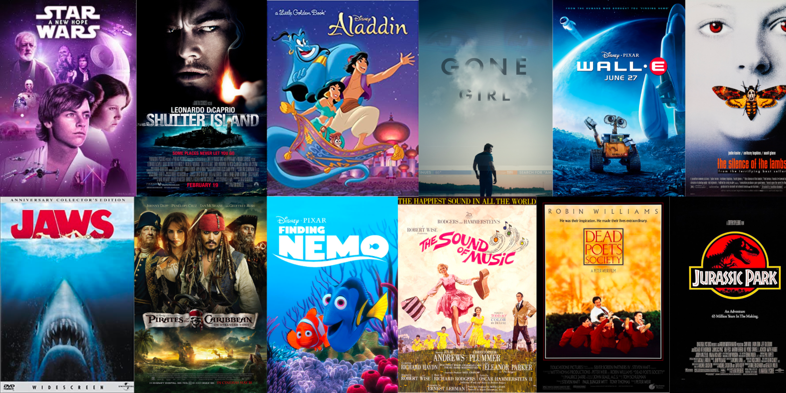

# Project Portfolio

### About Me 
Welcome! I'm Zaki, a recent graduate from Georgetown University with a passion for data and using data to drive informed decision-making. I am seeking a full-time role as a data analyst or in a position leveraging data analysis techniques. This portfolio highlights my experience and skills in data analysis, visualization, and programming, as detailed below.

#### Technical Skills: Excel, SQL, Tableau, APIs and Python (Pandas and Matplotlib libraries)

## Education 
- Bachelor of Science in Business Administration - Georgetown University (_Aug 2020 - May 2024_)

### Relevant Coursework
- Data Visualization in Tableau
- Developing and Managing Databases in SQL
- Introduction to Python
- Management Business Application Development in Python
  - **Final Project:** Cooking Buddy App (details below)
- Computer Science I in C++
- Modeling Analytics in Excel
- Decision Support Systems in VBA

## Projects 
### European Soccer Leagues Analysis Using SQL
[Github Project Link](https://github.com/Zaki978/European-Soccer-SQL-Data-Project)

Analyzed European soccer data across five major leagues (Premier League, La Liga, Bundesliga, Serie A, and Ligue 1) mainly using SQL. Through complex SQL queries, I extracted insights about team performance, player statistics, and league competitiveness from 2014 to 2020. Key analyses include analyzing home vs. away performance, tracking goal-scoring patterns, calculating team points distributions and evaluating league competitiveness through points gaps. 

The project demonstrates proficiency in SQL including CTEs, subqueries, window functions, set operations and complex joins. I handled the full project lifecycle and infrastructure: from SQLite database setup and CSV data ingestion, to database management and export for data visualization in Tableau, available on my [Tableau Public Profile](https://public.tableau.com/app/profile/zaki.bouaoudia4587/vizzes).

### IMDb Movie Ratings Analysis in Python (using Pandas and Matplotlib)

[Github Project Link](https://github.com/Zaki978/IMDb-Movie-Ratings-Analysis)

I conducted an in-depth analysis of IMDb movie ratings for films released over the past century (1920-2023). The primary objective was to uncover trends, patterns, and insights from the data, providing a comprehensive understanding of how movie ratings compare across different release periods of time.

The project involved extensive data cleaning, transformation, and manipulation using **Python** and the **pandas library**. Key tasks included renaming columns for clarity, converting data to appropriate types, handling missing values, and filtering the dataset to focus on movies exclusively and those with at least 278 ratings (top 75th percentile) to ensure statistical robustness. I also split the genres column into multiple rows for genre-level analysis and created a new column grouping movies by decade for deeper insights.

One key focus was analyzing trends in movie ratings, examining changes over decades movies were produced and visualizing them initially with **matplotlib and seaborn** and then in Tableau for more advanced analysis. Another significant focus was genre analysis, where I compared average genre ratings over time and identified which genres have gained or lost popularity. Additionally, a correlation analysis revealed how closely each genre's ratings align with overall rating trend, providing insights into the relationship between genres and movie ratings.

The cleaned and transformed data was exported to a CSV file for advanced analysis and interactive visualization in Tableau, available on my [Tableau Public Profile](https://public.tableau.com/app/profile/zaki.bouaoudia4587/vizzes).

### Data Visualization in Tableau

[My Tableau Public visualizations](https://public.tableau.com/app/profile/zaki.bouaoudia4587/vizzes)

Created a total of 8 visualizations across my European Soccer Leagues Analysis and IMDb Movie Ratings Analysis data projects. This includes 2 stories in which I dive into detail regarding the results of my analysis and the main takeaways of my exploration. My dashboards are customizable, flexible and dynamic, allowing users to use filters with different settings for their own needs. My visualizations include stacked bar charts, dual axis charts, heatmaps, treemaps and historgrams, utilizing techniques such as calculated fields, LOD expressions and parameters. 

### Cooking Buddy Web Application Using Python

[Github Project Link](https://github.com/Zaki978/recipefinder-final) | [Cooking Buddy Web App](https://cooking-buddy.onrender.com)

Cooking Buddy is a flask-based web application I built with two classmates as the final project for my Management Business Application Development in Python university class. As college students with limited experience cooking, we decided to create an app to help students discover recipes based on ingredients they have available.  

Users can input their available ingredients and apply filters for meal types (breakfast, lunch/dinner, snacks) and dish categories (appetizers, main courses, desserts), and receive personalized recipe suggestions complete with ingredient lists, nutritional information, and cooking instructions.

Built with Python and Flask, the application leverages the Edamam Recipe RESTful API for comprehensive recipe data, while utilizing Bootstrap 5 for a responsive, user-friendly interface. The project demonstrates skills in project management, API integration, and full-stack development. 

